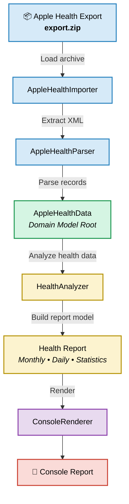

# Apple Health Monitor Analyzer

### Highlights

- 📅 Daily and monthly reports
- 😴 Automatic sleep session reconstruction
- 🚶 Activity and workout aggregation
- 📊 Deterministic and comparable reports
- 🤖 AI-friendly report format

## Overview

Apple Health Monitor Analyzer is a Python application that transforms raw Apple Health exports into structured daily and monthly reports.

The application parses Apple Health XML exports, reconstructs sleep sessions, aggregates daily activity metrics, and generates comprehensive reports designed for long-term health and fitness tracking.

Unlike the Apple Health application, which focuses on browsing recorded data, Apple Health Monitor Analyzer emphasizes consistency, transparency, and comparability. Every reported metric follows a documented methodology, allowing reports to be reliably compared across different reporting periods and parser versions.

The generated reports are intended to serve as a solid foundation for both personal analysis and AI-assisted interpretation, providing meaningful insights without requiring direct access to raw Apple Health data.

## Project Philosophy

Apple Health already provides an excellent interface for viewing health data.
This project is not intended to replace it.

Instead, its purpose is to transform Apple Health exports into deterministic,
well-documented reports that remain comparable over time.

Every design decision follows a simple principle:

> The same input data should always produce the same report.

This philosophy makes the reports suitable for long-term trend analysis,
independent verification, and AI-assisted interpretation.

## Features

### Data Processing

- Import Apple Health XML exports
- Parse and normalize health records
- Deterministic report generation
- Versioned report schema

### Activity Analysis

- Daily activity summaries
- Monthly activity summaries
- Steps, distance, active energy, exercise time, and stand hours
- Workout aggregation by activity type
- Daily and monthly workout statistics

### Sleep Analysis

- Automatic sleep session reconstruction
- Sleep stage aggregation
- Sleep duration and efficiency
- Average bedtime and wake-up time
- Monthly sleep statistics

### Reporting

- Human-readable console reports
- Daily and monthly summaries
- AI-friendly report format
- Documented calculation methodology

### Design

- Deterministic output
- Transparent calculations
- Comparable reports across time
- Extensible architecture

## Installation

## Usage

## Project Architecture

The application follows a layered architecture that separates data import, parsing, analysis, and presentation. Each component has a single responsibility, making the codebase easier to maintain, test, and extend.

The diagram is organized into five logical layers, each with a clearly defined responsibility.

| Layer | Responsibility |
|-------|----------------|
| 🔵 **Import** | Load and parse Apple Health export |
| 🟢 **Domain** | In-memory representation of imported health data |
| 🟡 **Analysis** | Calculate statistics and build report models |
| 🟣 **Presentation** | Render reports for the end user |
| 🔴 **Output** | Final human-readable report |

#### AppleHealthImporter

Responsible for loading the Apple Health export archive and extracting the XML data required for further processing.
The importer is intentionally isolated from the parsing logic, allowing the parser to operate independently of the data source.

#### AppleHealthParser

Parses Apple Health XML records and converts them into strongly typed domain objects.
The parser performs data transformation only and does not calculate statistics or generate reports.

#### AppleHealthData (Domain Model Root)

Acts as the central in-memory representation of imported health data.
All subsequent analysis operates exclusively on this domain model, making it the single source of truth for the application.

#### HealthAnalyzer

Processes the domain model and calculates all statistics, summaries, and reporting metrics.
All business logic is centralized here to ensure deterministic and reproducible reports.

#### Health Report

Represents the complete report independently of its presentation.
Separating report generation from rendering makes it easy to support additional output formats (e.g. HTML, Markdown or PDF) without modifying the analysis layer.

#### ConsoleRenderer

Transforms the report model into a human-readable console report.
The renderer contains no business logic and is responsible solely for presentation.

### Design Principles

- Single Responsibility Principle for every major component.
- Clear separation between parsing, analysis, and presentation.
- Domain-driven workflow based on an in-memory domain model.
- Deterministic report generation — the same input always produces the same output.
- Report models are presentation-agnostic, allowing multiple output formats to reuse the same analysis results.

## Domain Model

## Report Format

## Interpretation Notes

## Design Principles

## AI Analysis

## Versioning

## Roadmap

## License