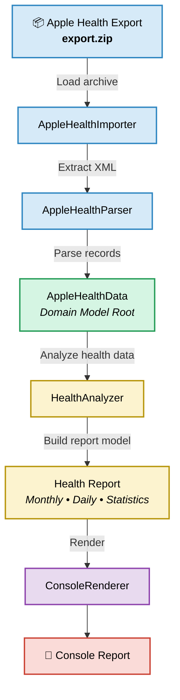
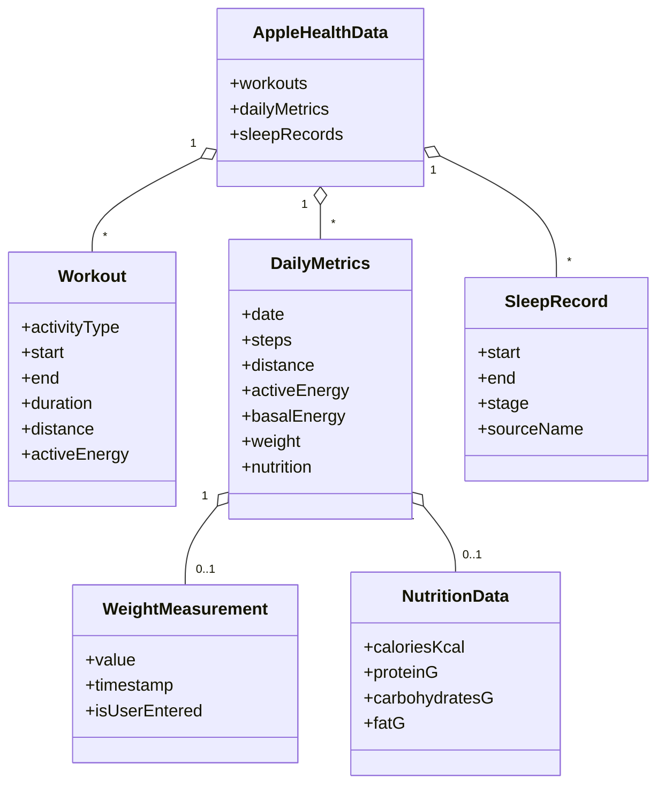
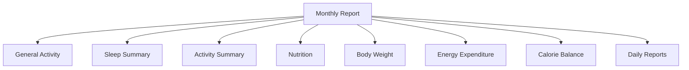
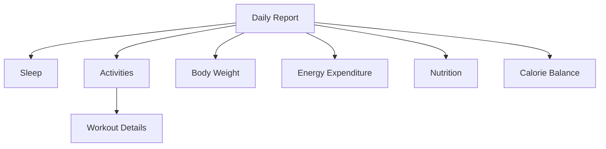

# Apple Health Monitor Analyzer

### Highlights

- 📅 Daily and monthly reports
- 😴 Automatic sleep session reconstruction
- 🚶 Activity and workout aggregation
- 📊 Deterministic and comparable reports
- 🤖 AI-friendly report format

## Overview

Apple Health Monitor Analyzer is a Python application that transforms raw Apple Health exports into structured daily and monthly reports.

The application parses Apple Health XML exports, reconstructs sleep sessions, aggregates daily activity, energy, body weight, and nutrition metrics, and generates comprehensive reports designed for long-term health and fitness tracking.

Unlike the Apple Health application, which focuses on browsing recorded data, Apple Health Monitor Analyzer emphasizes consistency, transparency, and comparability. Every reported metric follows a documented methodology, allowing reports to be reliably compared across different reporting periods and parser versions.

The generated reports are intended to serve as a solid foundation for both personal analysis and AI-assisted interpretation, providing meaningful insights without requiring direct access to raw Apple Health data.

## Project Philosophy

Apple Health already provides an excellent interface for viewing health data.
This project is not intended to replace it.

Instead, its purpose is to transform Apple Health exports into deterministic,
well-documented reports that remain comparable over time.

Every design decision follows a simple principle:

> The same input data should always produce the same report.

This philosophy makes the reports suitable for long-term trend analysis,
independent verification, and AI-assisted interpretation.

## Features

### Data Processing

- Import Apple Health XML exports
- Parse and normalize health records
- Deterministic report generation
- Versioned report schema

### Activity Analysis

- Daily activity summaries
- Monthly activity summaries
- Steps, distance, active energy and exercise time
- Workout aggregation by activity type
- Daily and monthly workout statistics
- Daily energy expenditure analysis (Basal Energy, Active Energy, TDEE)

### Body Weight Analysis

- Daily body weight tracking
- Monthly average, start, end, minimum and maximum weight
- Monthly body weight change
- Measurement coverage across the reporting period

### Nutrition Analysis

- Daily nutrition summaries
- Monthly nutrition summaries
- Energy intake
- Protein, carbohydrates and fat tracking
- Daily averages based on completed reporting days
- Daily and monthly calorie balance based on energy intake and TDEE

### Sleep Analysis

- Automatic sleep session reconstruction
- Sleep stage aggregation
- Sleep duration and efficiency
- Average bedtime and wake-up time
- Monthly sleep statistics

### Reporting

- Human-readable console reports
- Daily and monthly summaries
- AI-friendly report format
- Documented calculation methodology

### Design

- Deterministic output
- Transparent calculations
- Comparable reports across time
- Extensible architecture

## Usage

Run the application from the command line using the `import` command followed by the path to the Apple Health export archive.

### Basic Usage

```bash
python app.py import export.zip
```

Analyzes the current month of the current year.

### Analyze a Specific Month

```bash
python app.py import export.zip --month 7
```

Analyzes the specified month of the current year.

### Analyze a Specific Year and Month

```bash
python app.py import export.zip --year 2025 --month 12
```

Both `--year` and `--month` can be used together to analyze a specific month from a different year.

### Show Only Monthly Summary

```bash
python app.py import export.zip --month 7 --month-summary
```

Displays only the aggregated monthly statistics without the detailed daily report.

### Command Line Arguments

| Argument | Description |
|----------|-------------|
| `import` | Imports and analyzes an Apple Health export archive. |
| `file` | Path to the exported Apple Health ZIP archive. |
| `--month` | Month to analyze (`1`–`12`). Uses the current year if `--year` is omitted. |
| `--year` | Year to analyze. Can only be used together with `--month`. |
| `--month-summary` | Displays only the monthly summary. |

> **Note:** `--year` cannot be used without `--month`.

The application processes the archive and generates a structured console report containing monthly summaries, activity, energy, body weight, nutrition and sleep statistics.

## Project Architecture

The application follows a layered architecture that separates data import, parsing, analysis, and presentation. Each component has a single responsibility, making the codebase easier to maintain, test, and extend.



The diagram is organized into five logical layers, each with a clearly defined responsibility.

| Layer | Responsibility |
|-------|----------------|
| 🔵 **Import** | Load and parse Apple Health export |
| 🟢 **Domain** | In-memory representation of imported health data |
| 🟡 **Analysis** | Calculate statistics and build report models |
| 🟣 **Presentation** | Render reports for the end user |
| 🔴 **Output** | Final human-readable report |

#### AppleHealthImporter

    Responsible for loading the Apple Health export archive and extracting the XML data required for further processing.
    The importer is intentionally isolated from the parsing logic, allowing the parser to operate independently of the data source.

#### AppleHealthParser

    Parses Apple Health XML records and converts them into strongly typed domain objects.
    The parser performs data transformation only and does not calculate statistics or generate reports.

#### AppleHealthData (Domain Model Root)

    Acts as the central in-memory representation of imported health data.
    All subsequent analysis operates exclusively on this domain model, making it the single source of truth for the application.

#### HealthAnalyzer

    Processes the domain model and calculates all statistics, summaries, and reporting metrics.
    All business logic is centralized here to ensure deterministic and reproducible reports.

#### Health Report

    Represents the complete report independently of its presentation.
    Separating report generation from rendering makes it easy to support additional output formats (e.g. HTML, Markdown or PDF) without modifying the analysis layer.

#### ConsoleRenderer

    Transforms the report model into a human-readable console report.
    The renderer contains no business logic and is responsible solely for presentation.

### Architectural Principles

- Single Responsibility Principle for every major component.
- Clear separation between parsing, analysis, and presentation.
- Domain-driven workflow based on an in-memory domain model.
- Deterministic report generation — the same input always produces the same output.
- Report models are presentation-agnostic, allowing multiple output formats to reuse the same analysis results.

## Domain Model

The domain model represents the in-memory structure of Apple Health data after it has been parsed from the XML export.
It serves as the single source of truth for all analyses and report generation.


#### AppleHealthData

    Acts as the root of the application's domain model.
    It aggregates all imported health data and serves as the single source of truth for every analysis performed by the application.

#### Workout

    Represents a single workout session imported from Apple Health.
    It contains the workout type, start and end time, duration, active energy expenditure and, where available, distance.

#### DailyMetrics

    Represents aggregated metrics for a single calendar day.
    It stores step count, walking/running distance, active and basal energy expenditure, and optional body weight and nutrition data.
    Body weight and nutrition are represented by dedicated domain objects because they contain additional information and require their own parsing and aggregation rules.

#### WeightMeasurement

    Represents the body weight measurement selected for a given day.
    It stores the measured value, timestamp and whether the measurement was manually entered by the user.
    When multiple eligible body weight records exist for the same day, this information allows the parser to deterministically select the preferred measurement.

#### NutritionData

    Represents aggregated nutrition data for a single calendar day.
    It stores recorded energy intake together with protein, carbohydrate and fat consumption.
    Nutrition data is aggregated from individual Apple Health dietary records before being exposed to the analysis layer.

#### SleepRecord

    Represents a single sleep stage interval (e.g. Core, Deep, REM or Awake) recorded by Apple Health.

### Domain Model Principles

- XML-independent domain representation.
- Strongly typed domain objects.
- AppleHealthData acts as the single source of truth for parsed health data.
- Domain objects contain data rather than reporting or presentation logic.
- Related daily metrics are grouped into dedicated domain objects where appropriate.
- Business rules, aggregation and report generation are implemented by analyzers rather than domain entities.

## Report Format

The application generates a structured, human-readable console report that summarizes activity, energy expenditure, calorie balance, body weight, nutrition, sleep, and detailed daily health metrics.

The report is organized hierarchically, progressing from high-level monthly summaries to detailed daily breakdowns.

### Monthly Report Structure



### Daily Report Structure



### Reporting Areas

The report combines aggregated monthly statistics with detailed daily breakdowns.

Key reporting areas include:

- **General Activity** – steps, walking/running distance and average step length.
- **Workout Statistics** – recorded workout sessions, duration, energy and distance.
- **Energy Expenditure** – basal energy, active energy and TDEE.
- **Body Weight** – daily measurements and monthly weight statistics.
- **Nutrition** – daily and monthly energy intake and macronutrient summaries.
- **Sleep Summary** – sleep duration, stages, efficiency, bedtime and wake-up statistics.
- **Daily Reports** – day-by-day sleep, activity, workout, energy, body weight and nutrition data.

### Design Goals

- Human-readable console output.
- Consistent formatting throughout the report.
- Monthly overview followed by progressively more detailed information.
- Aggregated metrics presented before individual workout sessions.
- Report generation remains independent of its presentation layer, allowing additional output formats to be added in the future.

## Report Interpretation

The report is intended to provide meaningful trends rather than medical or scientific conclusions. Several metrics require proper interpretation due to the way Apple Health records and aggregates data.

### Sleep

Sleep statistics are calculated from recorded sleep stages and may differ from values reported directly by Apple Health.

Short interruptions, missing stages or incomplete recordings may affect sleep duration and efficiency calculations.

### Activities

Workout statistics are based solely on activities explicitly recorded in Apple Health.

Walking distance and step count are reported independently and should not be interpreted as direct indicators of workout intensity.

### Daily Metrics

Daily summaries aggregate all available records for a given calendar day.

If Apple Health contains incomplete or missing data, the report reflects the available information without attempting to estimate missing values.

### Nutrition

Nutrition values represent data recorded in Apple Health and are not inferred from other metrics.

For in-progress months, daily nutrition averages are calculated using completed reporting days only. The current day is excluded because its nutrition data may still be incomplete.

### Data Quality

The accuracy of every metric depends entirely on the quality of the exported Apple Health data.

The application does not modify, interpolate or infer missing values.

### General Notes

- The report is designed for long-term trend analysis rather than day-to-day fluctuations.
- Missing data is reported as missing whenever possible.
- For in-progress months, averages use completed reporting days only.
- All calculations are deterministic — identical input data always produces identical results.

## AI Analysis

The generated report is designed to be consumed not only by humans but also by Large Language Models (LLMs).

Prompt example:
```bash
Analyze the following Apple Health report. Focus on long-term trends rather than isolated daily values. Identify improvements, regressions, unusual patterns, consistency of physical activity, sleep quality, recovery and possible lifestyle observations. Base your conclusions only on the provided report and clearly distinguish facts from assumptions.
```

## Future Development

The project currently fulfills its original purpose.

Future development may include additional health metrics when practical needs arise, as well as technical improvements focused on maintainability, code quality and architecture.

## License

MIT License

See LICENSE for details.