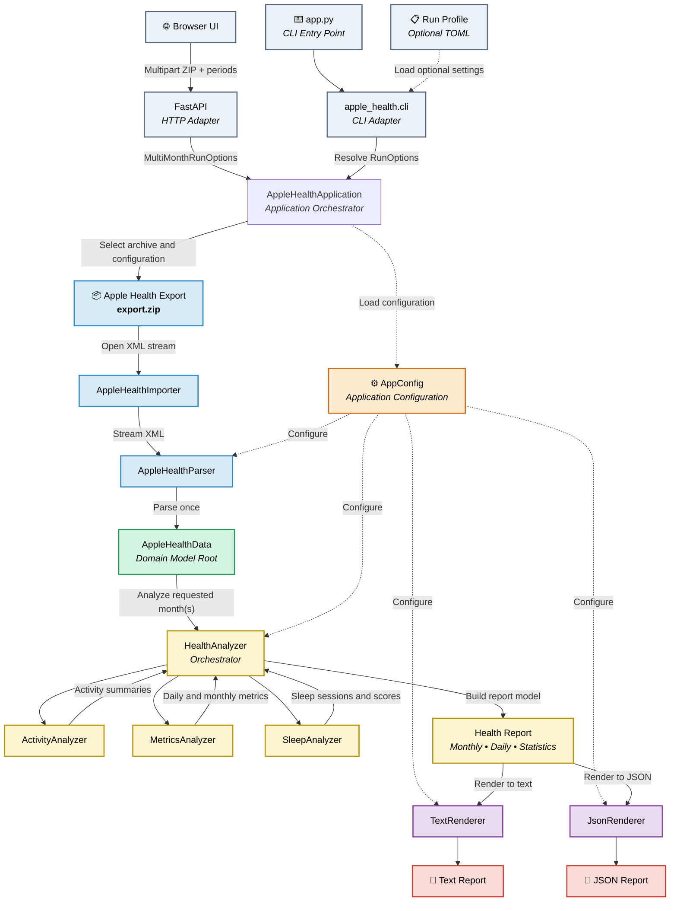
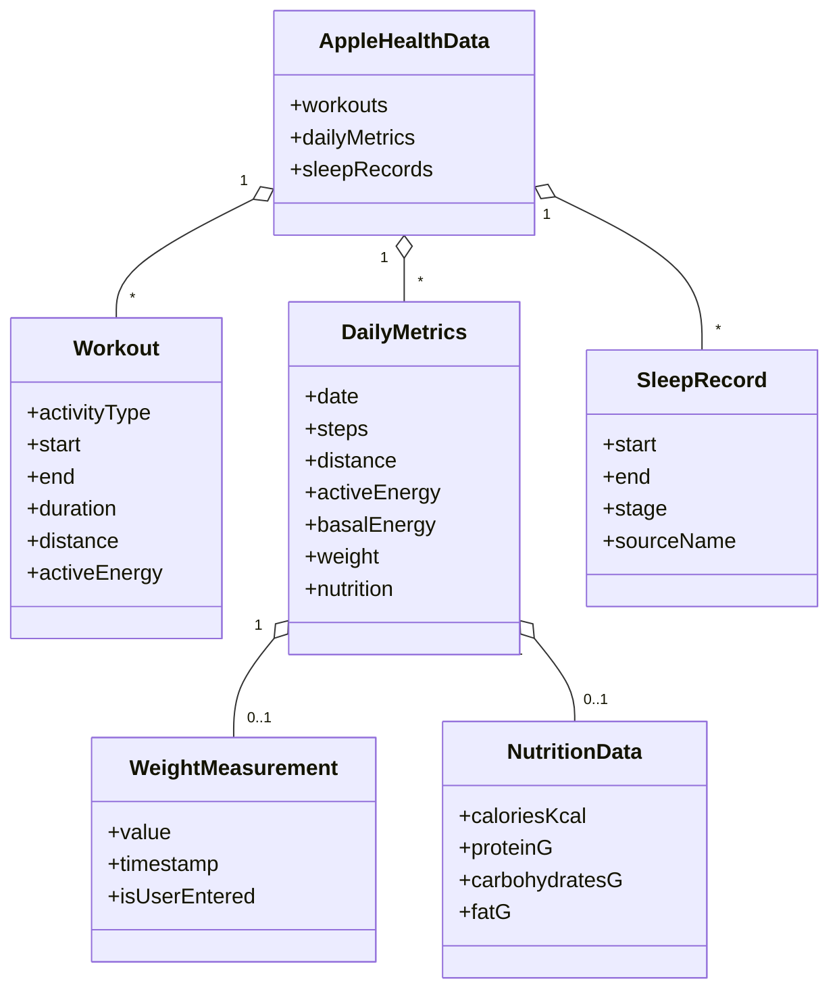
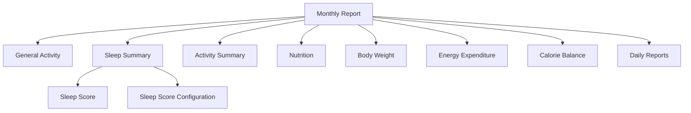
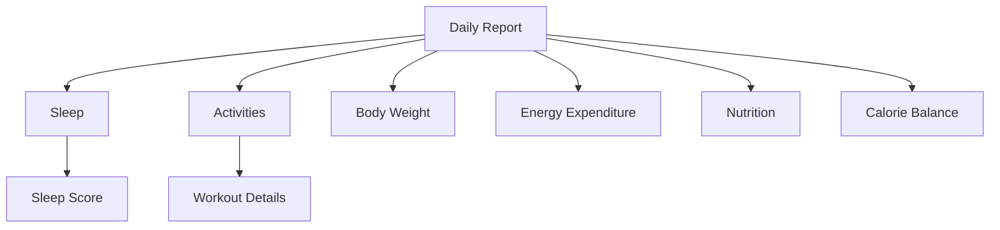

# Apple Health Monitor Analyzer

### Highlights

- 📅 Daily and monthly reports
- 🌐 Browser interface and FastAPI report-generation API
- 🗓️ Multi-month generation from a single Apple Health parse
- 😴 Automatic sleep session reconstruction
- 🚶 Activity and workout aggregation
- 📊 Deterministic and comparable reports
- 🤖 AI-friendly text and JSON report formats

## Overview

Apple Health Monitor Analyzer is a Python application that transforms raw Apple Health exports into structured daily and monthly reports. It can be used from the command line or through a local web interface backed by FastAPI.

The application parses Apple Health XML exports, reconstructs sleep sessions, aggregates daily activity, energy, body weight, and nutrition metrics, and generates comprehensive reports designed for long-term health and fitness tracking. The web workflow can generate multiple months from one uploaded archive while parsing the Apple Health XML only once.

Unlike the Apple Health application, which focuses on browsing recorded data, Apple Health Monitor Analyzer emphasizes consistency, transparency, and comparability. Every reported metric follows a documented methodology, allowing reports to be reliably compared across different reporting periods and parser versions.

The generated reports are intended to serve as a solid foundation for both personal analysis and AI-assisted interpretation, providing meaningful insights without requiring direct access to raw Apple Health data.

## Project Philosophy

Apple Health already provides an excellent interface for viewing health data.
This project is not intended to replace it.

Instead, its purpose is to transform Apple Health exports into deterministic,
well-documented reports that remain comparable over time.

Every design decision follows a simple principle:

> The same input data should always produce the same report.

This philosophy makes the reports suitable for long-term trend analysis,
independent verification, and AI-assisted interpretation.

## Features

### Data Processing

- Import Apple Health XML exports
- Parse and normalize health records
- Deterministic report generation
- Versioned report schema

### Activity Analysis

- Daily activity summaries
- Monthly activity summaries
- Steps, distance, active energy and workout duration
- Workout aggregation by activity type
- Daily and monthly workout statistics
- Daily energy expenditure analysis (Basal Energy, Active Energy, TDEE)

### Body Weight Analysis

- Daily body weight tracking
- Monthly average, start, end, minimum and maximum weight
- Monthly body weight change
- Measurement coverage across the reporting period

### Nutrition Analysis

- Daily nutrition summaries
- Monthly nutrition summaries
- Energy intake
- Protein, carbohydrates and fat tracking
- Daily averages based on completed reporting days
- Daily and monthly calorie balance based on energy intake and TDEE

### Sleep Analysis

- Automatic sleep session reconstruction
- Sleep stage aggregation
- Sleep duration and efficiency
- Average bedtime and wake-up time
- Configurable daily sleep scoring
- Monthly sleep score averages and component breakdown
- Optional configurable monthly sleep score bonuses
- Monthly sleep statistics

### Reporting

- Human-readable text reports
- Structured JSON reports with a versioned schema
- Daily and monthly summaries
- Four report variants per selected month: full text, full JSON, summary text, and summary JSON
- AI-friendly report formats
- Effective Sleep configuration included in monthly text and JSON reports
- Partial monthly reports that preserve available data when individual sections are missing
- Documented calculation methodology

### Web and API

- FastAPI application with a browser-based report generator
- Multipart Apple Health ZIP upload
- Selection of one or more reporting months using `YYYY-MM` periods
- One archive parse shared across all requested months
- Browser downloads for all four generated report variants
- Health-check endpoint for deployment readiness
- Disposable temporary ZIP handling with cleanup after success or failure
- Application-level limits for upload size, uncompressed export XML size, and number of requested periods
- Non-cacheable report-generation responses (`Cache-Control: no-store`)

### Design

- Deterministic output
- Transparent calculations
- Comparable reports across time
- Extensible architecture

## Usage

The project currently supports two entry points: a browser/FastAPI workflow for multi-month report generation and the original command-line interface for single-month execution. Both reuse the same application, parser, analyzer, and renderer layers.

### Web Interface

Start the FastAPI application with Uvicorn:

```bash
uvicorn apple_health.api.app:app --reload
```

Then open the local application in a browser, normally at `http://127.0.0.1:8000/`.

The web interface allows you to:

1. select an Apple Health export ZIP,
2. choose one or more reporting months,
3. generate all selected months in one request, and
4. download `full.txt`, `full.json`, `summary.txt`, or `summary.json` for each generated month.

The uploaded ZIP is copied to a disposable temporary file for processing and is deleted when the request completes, including controlled failure paths. Generated report content is returned directly to the browser; P4 does not persist reports on the server.

> **Current deployment status:** the web application does not yet include authentication. It is intended for local/development use until the private-authentication phase is implemented. Do not expose the report-generation endpoint publicly without an appropriate access-control layer.

### Report Generation API

`POST /reports/generate` accepts multipart form data:

| Field | Description |
| --- | --- |
| `archive` | Apple Health export ZIP archive |
| `periods` | Comma-separated reporting periods in strict `YYYY-MM` format |

Example:

```bash
curl -X POST \
  -F "archive=@export.zip" \
  -F "periods=2026-07,2026-08" \
  http://127.0.0.1:8000/reports/generate
```

The response contains one object per requested month. Each object includes the reporting year/month and four rendered strings:

```json
{
  "reports": [
    {
      "year": 2026,
      "month": 8,
      "full_text": "...",
      "full_json": "...",
      "summary_text": "...",
      "summary_json": "..."
    }
  ]
}
```

Requested periods preserve their request order. Duplicate periods are rejected, and at most 120 periods may be requested in one call.

Other HTTP endpoints:

| Endpoint | Purpose |
| --- | --- |
| `GET /` | Browser report-generation interface |
| `GET /health` | Lightweight API health check |
| `GET /favicon.svg` | Web-interface favicon |

### Upload and Processing Limits

P4 includes application-level resource safeguards around Apple Health uploads:

- uploaded ZIP data is copied in 1 MiB chunks instead of being read into memory as one byte string,
- compressed upload size is limited to 1 GiB by the application,
- the selected Apple Health XML entry is limited to 4 GiB of declared uncompressed size,
- at most 120 reporting periods are accepted per generation request,
- the importer streams the selected XML entry directly from the ZIP,
- the parser processes XML incrementally with `ElementTree.iterparse()` and clears processed elements, and
- the ZIP is never extracted to an arbitrary filesystem path.

These are application safeguards, not a complete public-hosting security layer. Reverse-proxy/request limits, authentication, rate/concurrency controls, HTTPS, and production API-documentation settings belong to the later deployment/authentication phases.

### Command Line Interface

Run the application from the command line using the `import` command followed by the path to the Apple Health export archive.

#### Basic Usage

```bash
python app.py import export.zip
```

Analyzes the current month of the current year.

#### Analyze a Specific Month

```bash
python app.py import export.zip --month 7
```

Analyzes the specified month of the current year.

#### Analyze a Specific Year and Month

```bash
python app.py import export.zip --year 2025 --month 12
```

Both `--year` and `--month` can be used together to analyze a specific month from a different year.

#### Show Only Monthly Summary

```bash
python app.py import export.zip --month 7 --month-summary
```

Displays only the aggregated monthly statistics without the detailed daily report.

#### JSON Output

Use `--format json` to generate a structured JSON report instead of the default text output.

```bash
python app.py import export.zip --month 8 --format json
```

JSON output uses a versioned schema intended for machine consumption, API integration, and frontend clients. Numeric values remain JSON numbers, dates and timestamps use ISO-compatible representations, and unavailable report sections are represented explicitly with `null` while empty collections remain `[]`.

Combine JSON output with `--month-summary` to return only monthly aggregates without daily entries:

```bash
python app.py import export.zip --month 8 --month-summary --format json
```

Text output remains the default when `--format` is omitted.

### Run Profiles

Application execution can be described by an optional TOML run profile. A profile may define the archive path, reporting period, output mode, monthly-summary mode, and the path to the application configuration file.

```bash
python app.py --profile apple_health/application/examples/run.example.toml
```

Run profiles may be partial. Final run options are resolved using the following precedence:

```text
CLI flags
    ↓
run.toml
    ↓
built-in defaults
```

This allows a reusable profile to provide normal execution settings while individual CLI flags override them for a single run. For example:

```bash
python app.py --profile apple_health/application/examples/run.month-summary.toml --enforce-daily --format text
```

`--month-summary` explicitly enables summary-only output, while `--enforce-daily` explicitly disables it and requests daily report details.

Example run profiles are available in `apple_health/application/examples/`.

### Runtime Configuration

Use `--config` to load an optional TOML application configuration file:

```bash
python app.py import export.zip --month 8 --config apple_health/config/examples/config.example.toml
```

When `--config` is omitted, the application uses the defaults defined by the configuration dataclasses.

TOML files may be partial: only explicitly provided values override defaults. Configuration keys are case-insensitive, unknown fields fail fast, and invalid values stop the application with a configuration error.

Example application configuration files are available in [`apple_health/config/examples/`](apple_health/config/examples/). For the complete configuration reference, see [`apple_health/config/README.md`](apple_health/config/README.md).

### Command Line Arguments

| Argument | Description |
|----------|-------------|
| `import` | Imports and analyzes an Apple Health export archive. |
| `file` | Path to the exported Apple Health ZIP archive. |
| `--profile` | Path to an optional TOML run profile. |
| `--month` | Month to analyze (`1`–`12`). Overrides the profile value when supplied. |
| `--year` | Year to analyze. Overrides the profile value when supplied. |
| `--month-summary` | Explicitly enables monthly-summary-only output. |
| `--enforce-daily` | Explicitly requests daily report details, overriding `month_summary = true` from a profile. |
| `--format` | Output format: `text` or `json`. Overrides the profile value when supplied. |
| `--config` | Path to an optional TOML application configuration file. Overrides the profile value when supplied. |

The CLI processes one reporting month per execution and generates either a structured human-readable text report or a versioned JSON representation containing monthly summaries, activity, energy, body weight, nutrition and sleep statistics. The multi-month four-output workflow is exposed separately through `AppleHealthApplication.generate_reports()` and the FastAPI endpoint.

## Project Architecture

The application follows a layered architecture that separates application execution, data import, parsing, analysis, and presentation. Each component has a single responsibility, making the codebase easier to maintain, test, and extend.



The diagram keeps the processing core independent from its adapters. The CLI and FastAPI layers both delegate to the same application orchestration and therefore share the same parsing, analysis, configuration, and rendering behavior.

| Layer | Responsibility |
|-------|----------------|
| ⚪ **Adapters** | Translate CLI or HTTP input into application-level execution options |
| 🔵 **Import** | Open and stream the Apple Health export XML |
| 🟢 **Domain** | In-memory representation of imported health data |
| 🟡 **Analysis** | Calculate statistics and build report models |
| 🟣 **Presentation** | Render report models into text or JSON representations |
| 🔴 **Output** | Final human-readable or machine-readable report |

Application execution is coordinated by `AppleHealthApplication`. `run()` preserves the single-month CLI workflow, while `generate_reports()` supports the web/API workflow by parsing one archive once and rendering four report variants for every requested `ReportPeriod`.

Configuration is treated as a cross-cutting application concern rather than a separate processing layer. A single `AppConfig` instance is created for each application run and injected into components that require configurable behavior.

#### CLI

The `apple_health.cli` module owns command-line argument parsing and validation. It combines explicit CLI input with optional run-profile values and delegates final option resolution to `RunOptionsResolver`.

The top-level `app.py` module acts only as the CLI entry point and delegates execution to this adapter. Report-processing logic remains isolated in `AppleHealthApplication`; the FastAPI adapter reuses the same application workflow without depending on command-line parsing.

#### AppConfig

Acts as the root of the application's configuration model. It groups configuration by responsibility and is created once for each application run before being injected into configurable components.

Detailed configuration structure, TOML loading behavior, defaults, validation rules, and examples are documented in [`apple_health/config/README.md`](apple_health/config/README.md).

#### AppleHealthImporter

Responsible for opening the Apple Health export archive and exposing the single eligible Apple Health XML entry as a stream. The importer does not extract the XML to an arbitrary filesystem path.

The importer owns the lifecycle of both the ZIP archive and XML stream through its context-managed interface. It accepts localized main-export XML filenames within the `apple_health_export` directory, excludes CDA XML documents, requires exactly one eligible XML entry, and rejects an entry whose declared uncompressed size exceeds the configured 4 GiB safety limit. It is intentionally isolated from parsing logic, allowing the parser to operate independently of the data source.

#### AppleHealthParser

Parses Apple Health XML records and converts them into strongly typed domain objects.
The parser performs data transformation only and does not calculate statistics or generate reports.

The parser consumes the ZIP entry incrementally with `ElementTree.iterparse()`, validates the `HealthData` root element, and clears processed XML elements. This avoids materializing the complete export XML document as one in-memory string.

#### FastAPI Adapter

Owns the HTTP boundary for the browser workflow. It validates reporting-period input, copies uploads to a disposable temporary ZIP in chunks, maps known malformed-upload conditions to stable client errors, closes the uploaded file, and returns generated reports without persisting them.

The adapter does not accept arbitrary server-side archive or configuration paths from remote clients. Multi-month requests are converted into `MultiMonthRunOptions` before being passed to the application layer.

#### Multi-month Application Contract

`ReportPeriod` represents one strict `YYYY-MM` reporting period. `MultiMonthRunOptions` groups the temporary archive path with an ordered tuple of periods and optional application configuration. `MonthlyReports` carries the four rendered artifacts produced for one month.

`AppleHealthApplication.generate_reports()` loads configuration once, opens and parses the Apple Health export once, creates one analyzer over the resulting `AppleHealthData`, and then summarizes and renders each requested month independently. This preserves the core P4 invariant:

```text
ONE ZIP
→ ONE PARSE
→ ONE AppleHealthData
→ N MONTHS
→ 4 REPORTS PER MONTH
```

#### AppleHealthData (Domain Model Root)

Acts as the central in-memory representation of imported health data.
All subsequent analysis operates exclusively on this domain model, making it the single source of truth for the application.

#### HealthAnalyzer

Acts as the analysis-layer orchestrator.
It coordinates specialized analyzers and combines their results into daily and monthly report models.

#### ActivityAnalyzer

Processes workout data and builds daily and monthly activity summaries, including workout duration, active energy expenditure and distance.

#### MetricsAnalyzer

Processes aggregated daily metrics and calculates daily and monthly statistics for steps, walking/running distance, energy expenditure, body weight and nutrition.

#### SleepAnalyzer

Reconstructs sleep sessions from chronologically ordered Apple Health sleep records, selects the primary sleep session for each reporting day, calculates sleep statistics and applies the configurable Sleep Score model.

#### Health Report

Represents the complete report independently of its presentation.
Separating report generation from rendering makes it easy to support additional output formats (e.g. HTML, Markdown or PDF) without modifying the analysis layer.

#### TextRenderer

Transforms the report model into a human-readable text representation.
The renderer contains no business logic and builds output in an isolated in-memory writer without redirecting global process output. It returns the rendered report as a string, leaving the application layer responsible for deciding where that output is sent.

#### JsonRenderer

Transforms the same report models into a structured, versioned JSON representation intended for machine consumption, future API endpoints, frontend clients, and AI-assisted workflows.

The JSON contract uses stable technical identifiers, explicit measurement units in field names, ISO-compatible date/time representations, `null` for unavailable optional sections, `[]` for empty collections, and normalized numeric precision. Monthly and daily report data share the same high-level section structure wherever practical.

Both renderers are isolated in the `renderers` package, allowing presentation formats to evolve independently from import, parsing, and analysis logic.

### Architectural Principles

- Single Responsibility Principle for every major component.
- Clear separation between parsing, specialized analysis, report construction, rendering, and output.
- Domain-driven workflow based on an in-memory domain model.
- Deterministic report generation — the same input always produces the same output.
- Report models are presentation-agnostic, allowing multiple output formats to reuse the same analysis results.
- Specialized analyzers separate activity, daily metrics and sleep responsibilities behind a single `HealthAnalyzer` orchestration layer.
- Renderers produce representations of report models without controlling the final output destination.
- Configurable components receive application settings through dependency injection rather than depending on module-level configuration globals.
- CLI and HTTP adapters remain outside report-processing business logic.
- Multi-month generation parses each uploaded archive once and reuses one `AppleHealthData` instance across requested months.
- Temporary uploaded archives are disposable inputs rather than durable application state.

## Configuration

Application behavior is represented by a hierarchy of strongly typed Python dataclasses rooted in `AppConfig`.

The configuration model separates settings by responsibility, including source selection, sleep-session reconstruction, and Sleep Score behavior. A single `AppConfig` instance is created for each application run and passed through the processing pipeline using dependency injection.

```text
AppConfig
├── AppleHealthParser
├── HealthAnalyzer
│   └── SleepAnalyzer
├── TextRenderer
└── JsonRenderer
```

Components retain default configuration behavior when instantiated independently, while the application can supply one shared configuration instance for a complete processing run.

Configuration values come from defaults defined by the configuration dataclasses and may be overridden at runtime by an optional TOML file loaded through `ConfigLoader`. Missing values continue to use dataclass defaults.

For the complete configuration hierarchy, default values, validation rules, and configuration architecture, see [`apple_health/config/README.md`](apple_health/config/README.md).

## Domain Model

The domain model represents the in-memory structure of Apple Health data after it has been parsed from the XML export.
It serves as the single source of truth for all analyses and report generation.


#### AppleHealthData

Acts as the root of the application's domain model.
It aggregates all imported health data and serves as the single source of truth for every analysis performed by the application.

#### Workout

Represents a single workout session imported from Apple Health.
It contains the workout type, start and end time, duration, active energy expenditure and, where available, distance.

#### DailyMetrics

Represents aggregated metrics for a single calendar day.
It stores step count, walking/running distance, active and basal energy expenditure, and optional body weight and nutrition data.
Body weight and nutrition are represented by dedicated domain objects because they contain additional information and require their own parsing and aggregation rules.

#### WeightMeasurement

Represents the body weight measurement selected for a given day.
It stores the measured value, timestamp and whether the measurement was manually entered by the user.
When multiple eligible body weight records exist for the same day, this information allows the parser to deterministically select the preferred measurement.

#### NutritionData

Represents aggregated nutrition data for a single calendar day.
It stores recorded energy intake together with protein, carbohydrate and fat consumption.
Nutrition data is aggregated from individual Apple Health dietary records before being exposed to the analysis layer.

#### SleepRecord

Represents a single sleep stage interval (e.g. Core, Deep, REM or Awake) recorded by Apple Health.

### Domain Model Principles

- XML-independent domain representation.
- Strongly typed domain objects.
- AppleHealthData acts as the single source of truth for parsed health data.
- Domain objects contain data rather than reporting or presentation logic.
- Related daily metrics are grouped into dedicated domain objects where appropriate.
- Business rules, aggregation and report generation are implemented by analyzers rather than domain entities.

## Report Format

The application can generate both a structured, human-readable text report and a versioned JSON representation summarizing activity, energy expenditure, calorie balance, body weight, nutrition, sleep, sleep scoring, and detailed daily health metrics.

For every period requested through the multi-month workflow, the application produces four independent representations: full text, full JSON, summary text, and summary JSON. P4 returns these representations directly to the API client; durable report storage is planned for the Google Drive phase.

The report is organized hierarchically, progressing from high-level monthly summaries to detailed daily breakdowns.

### Monthly Report Structure



### Daily Report Structure



### Reporting Areas

The report combines aggregated monthly statistics with detailed daily breakdowns.

Key reporting areas include:

- **General Activity** – steps, walking/running distance and average step length.
- **Workout Statistics** – recorded workout sessions, duration, energy and distance.
- **Energy Expenditure** – basal energy, active energy and TDEE.
- **Body Weight** – daily measurements and monthly weight statistics.
- **Nutrition** – daily and monthly energy intake and macronutrient summaries.
- **Sleep Summary** – sleep duration, stages, efficiency, bedtime and wake-up statistics.
- **Sleep Score** – configurable daily scoring based on bedtime, sleep duration and wake-up time, with monthly component averages and optional performance and consistency bonuses.
- **Sleep Configuration** – effective sleep-session and Sleep Score settings used to calculate the reported monthly results.
- **Daily Reports** – day-by-day sleep, activity, workout, energy, body weight and nutrition data.

### Design Goals

- Human-readable text output and machine-readable JSON output.
- Consistent formatting and stable JSON schema contracts.
- Monthly overview followed by progressively more detailed information.
- Aggregated metrics presented before individual workout sessions.
- Report generation remains independent of its presentation layer, allowing additional output formats to be added in the future.


### JSON Report Contract

JSON reports use `schema_version: "1.0"` and preserve a stable top-level structure for monthly report data:

- `report` – report metadata such as year, month, reporting days and data coverage
- `general_activity` – steps, distance and step length
- `sleep` – monthly or daily sleep details and Sleep Score data; monthly sleep output also exposes the effective sleep configuration used for scoring
- `workouts` – workout summaries using stable technical identifiers such as `indoor_cycling`
- `body_weight` – body-weight measurements and monthly statistics
- `energy_expenditure` – basal energy, active energy and TDEE
- `nutrition` – calorie intake and macronutrients
- `average_calories_balance_kcal` / `calories_balance_kcal` – calorie balance kept separate from nutrition because it depends on both energy intake and expenditure
- `days` – detailed daily reports when the full monthly report is requested

Unavailable optional sections are represented as `null`, while empty collections such as months or days without workouts are represented as `[]`. Numeric measurements remain JSON numbers and are normalized to two decimal places for a predictable external contract.

The JSON renderer deliberately exposes a presentation/API contract rather than directly serializing internal dataclasses. This allows the internal report models to evolve without automatically breaking external consumers.

## Report Interpretation

The report is intended to provide meaningful trends rather than medical or scientific conclusions. Several metrics require proper interpretation due to the way Apple Health records and aggregates data.

### Sleep

Sleep statistics are calculated from recorded sleep stages and may differ from values reported directly by Apple Health.

Short interruptions, missing stages or incomplete recordings may affect sleep duration and efficiency calculations.

### Sleep Score

The Daily Sleep Score evaluates adherence to configurable sleep targets using three components: bedtime, sleep duration and wake-up time.

Each component is scored on a 0–100 scale. The final daily score is calculated as a configurable weighted average of the three component scores.

Bedtime scoring rewards going to sleep at or before the configured target and applies penalties for later bedtimes.

Sleep duration scoring uses a configurable target and tolerance range, with separate penalty weights for oversleeping and undersleeping.

Wake-up scoring uses the Bedtime Score and Duration Score to determine the maximum available Wake-up Score before applying any penalty for waking later than the configured target. The relative influence of bedtime and sleep duration on this maximum score is configurable.

Penalties can be calculated using either step-based or linear progression. Step-based penalties are used by default.

Sleep stages such as Core, Deep and REM remain available for analysis but do not affect the Sleep Score.

Monthly sleep scoring reports the average Bedtime Score, Duration Score, Wake-up Score and Total Sleep Score across completed reporting days.

Monthly text and JSON reports also include the effective `AppConfig.sleep` configuration used for the run. This makes the reported scores self-describing and allows the same output to be interpreted correctly even when runtime TOML overrides were used.

An optional monthly bonus system can extend the monthly score above the base 0–100 scale. The effective maximum is calculated as `100 + max_points` when the bonus system is enabled. The bonus system consists of two independently calculated components:

- **Average Bonus** – rewards reaching configurable monthly average Sleep Score thresholds.
- **Consistency Bonus** – rewards consistency based on the population standard deviation of Daily Sleep Scores.

Both bonus threshold sets are configurable. The maximum combined bonus is also configurable and validated against the configured threshold values.

When the monthly bonus system is disabled, the report continues to provide the standard monthly Sleep Score without applying any bonuses, and the effective maximum remains `100`.

### Activities

Workout statistics are based solely on activities explicitly recorded in Apple Health.

Walking distance and step count are reported independently and should not be interpreted as direct indicators of workout intensity.

### Daily Metrics

Daily summaries aggregate all available records for a given calendar day.

If Apple Health contains incomplete or missing data, the report reflects the available information without attempting to estimate missing values.

### Nutrition

Nutrition values represent data recorded in Apple Health and are not inferred from other metrics.

For in-progress months, daily nutrition averages are calculated using completed reporting days only. The current day is excluded because its nutrition data may still be incomplete.

### Data Quality

The accuracy of every metric depends entirely on the quality of the exported Apple Health data.

The application does not modify, interpolate or infer missing values.

### General Notes

- The report is designed for long-term trend analysis rather than day-to-day fluctuations.
- Missing data is reported as missing whenever possible.
- For in-progress months, averages use completed reporting days only.
- All calculations are deterministic — identical input data and identical sleep scoring configuration always produce identical results.

## AI Analysis

The generated report is designed to be consumed not only by humans but also by Large Language Models (LLMs). Monthly reports include the effective sleep-scoring configuration alongside the calculated Sleep Score, allowing an AI consumer to interpret the result using the exact targets, weights, penalties, and bonus thresholds that produced it.

Prompt example:
```bash
Analyze the following Apple Health report. Focus on long-term trends rather than isolated daily values. Identify improvements, regressions, unusual patterns, consistency of physical activity, sleep quality, recovery and possible lifestyle observations. Base your conclusions only on the provided report and clearly distinguish facts from assumptions.
```

## Testing

The project includes a comprehensive automated test suite covering core business logic, Apple Health data processing, the application layer, the FastAPI boundary, renderers, and end-to-end report generation.

The test suite currently contains **298 test cases**, including coverage for:

- sleep analysis and scoring
- activity and health metrics analysis
- Apple Health XML parsing and root validation
- ZIP import handling, localized export filenames, and uncompressed XML size limits
- configuration validation
- report models
- text rendering
- JSON rendering and API contract behavior
- command-line parsing and CLI validation
- application execution and run-option resolution
- strict `ReportPeriod` parsing and validation
- multi-month application orchestration with one parse per archive
- FastAPI upload, period, error-handling, cleanup, and privacy behavior
- run-profile loading, structure validation, and precedence
- end-to-end single- and multi-month report generation

Run the complete test suite with:

```bash
pytest
```

Code quality checks:

```bash
ruff check .
black --check .
```

For a detailed breakdown of the test suite, see [`tests/README.md`](tests/README.md).

## Current Web-Application Boundary

P4 establishes the report-generation boundary but deliberately does not implement persistent cloud storage or public authentication yet. Current behavior is intentionally stateless:

```text
Browser
  ↓ multipart ZIP + selected periods
FastAPI
  ↓ disposable temporary ZIP
AppleHealthApplication.generate_reports()
  ↓ parse once
AppleHealthData
  ↓ analyze N months
4 rendered reports per month
  ↓
HTTP response / browser downloads
```

The uploaded Apple Health ZIP is not application-level durable storage, and generated reports are not persisted by P4. This separation allows later storage and authentication work to be added around a tested report-generation core without changing the domain pipeline.

## Future Development

The processing and multi-month generation foundation is complete. The next planned web-application phases are:

1. **Google Drive report storage** – store generated monthly artifacts in a private dedicated Drive folder, list available reports, and support safe regeneration/replacement semantics.
2. **Web report viewer** – list stored months and render monthly summaries, day-by-day data, charts, and download links from stored JSON/report artifacts.
3. **Private authentication** – protect health-report access and generation before public exposure.
4. **Stateless/free deployment** – deploy the application with HTTPS and hosting-layer request/resource controls while keeping Google Drive as durable report storage.

The intended durable report layout is one directory per month containing `full.json`, `full.txt`, `summary.json`, and `summary.txt`. The uploaded Apple Health export remains disposable input and is not intended to be persisted.

Additional health metrics and presentation formats may be added when they provide concrete value, but they are intentionally secondary to completing the private hosted-report workflow.

## License

MIT License

See LICENSE for details.