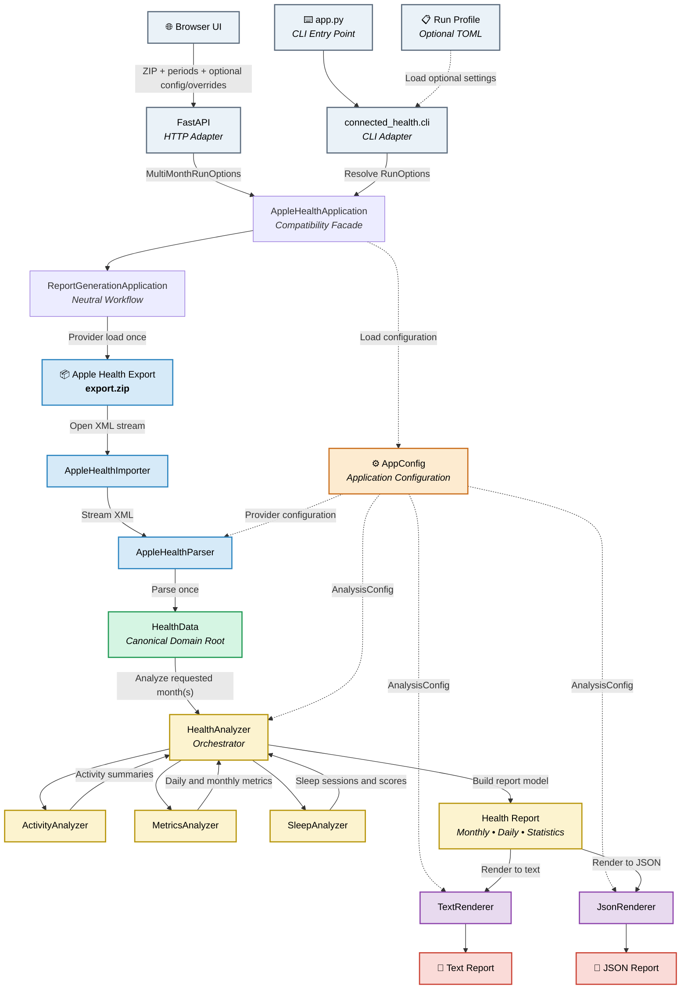
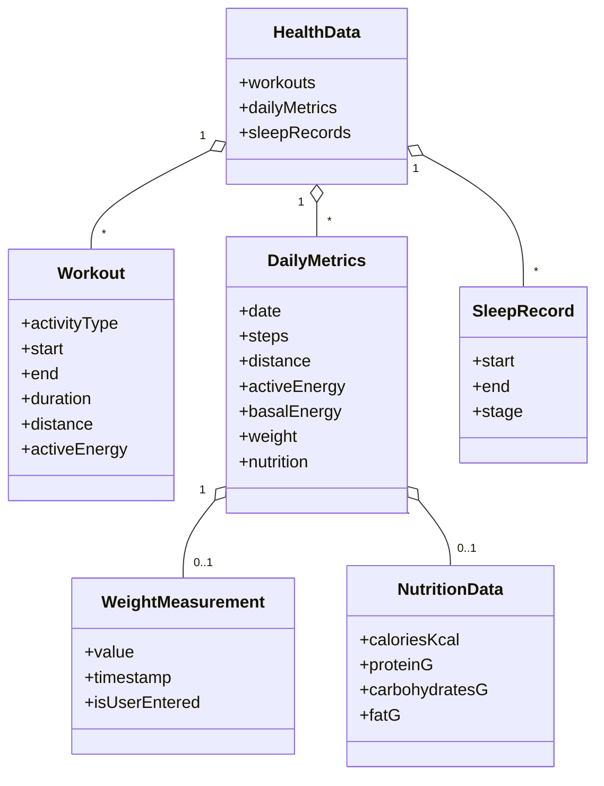
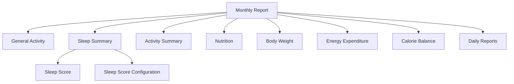
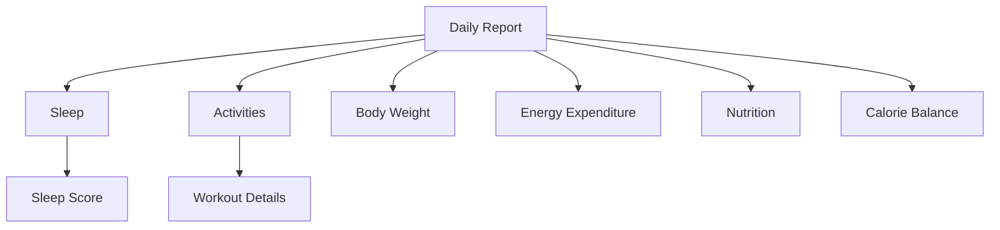

# Connected Health Analyzer

Connected Health Analyzer turns exported personal health data into deterministic,
well-documented daily and monthly reports that can be compared over time.

The application is designed around a provider-neutral analysis core. Provider-specific
input is normalized into the canonical `HealthData` model before it reaches shared
analyzers, report models, and renderers.

**Currently supported health-data provider: Apple Health.**

The browser makes that provider choice explicit before showing the Apple-specific
workflow. Apple Health exports can be processed locally without an account, or with an
optional Google connection for Drive-based ZIP selection, saved configuration profiles,
and report persistence.

### Highlights

- 🧩 Provider-oriented architecture with a canonical `HealthData` boundary
- 🍎 Apple Health export ZIP support
- 📅 Daily and monthly reports
- 🗓️ Multi-month generation from a single provider load
- 🌐 Browser interface and FastAPI report-generation API
- ☁️ Optional Google sign-in with Google Drive ZIP selection, saved configurations, and report persistence
- ⚙️ Optional `config.toml` upload plus Apple source overrides
- 😴 Automatic sleep session reconstruction and configurable Sleep Score
- 🚶 Activity, workout, body-weight, energy, and nutrition aggregation
- 🧩 Missing-data-aware monthly averages with per-metric coverage
- 📊 Deterministic and comparable text and JSON reports
- 🤖 Stable JSON contract designed for future viewers and AI-assisted workflows

## Overview

Connected Health Analyzer separates **health-data ingestion** from **health-data
analysis**.

Each provider is responsible for understanding its own raw export format and converting
it into canonical `HealthData`. From that boundary onward, the shared analysis and
reporting pipeline is provider-neutral.

The current provider is Apple Health:

```text
Apple Health export ZIP
        ↓
AppleHealthProvider
        ↓
canonical HealthData
        ↓
HealthAnalyzer
        ↓
MonthlySummary
        ↓
text / JSON reports
```

For Apple Health, the application parses the export XML, reconstructs sleep sessions,
aggregates activity, energy, body weight, nutrition, and workout data, and generates
structured reports for one or more selected months.

The goal is not to replace the source application used to collect or browse health data.
Connected Health Analyzer focuses on reproducible analysis: the same normalized input
and effective configuration should produce the same report.

The generated reports are suitable for long-term trend analysis, independent inspection,
and AI-assisted interpretation without requiring an AI system to access the raw health
export.

## Project Philosophy

Health-data platforms are good at collecting and displaying measurements. This project
focuses on a different problem: turning exported health history into a stable,
transparent analytical record.

Every design decision follows a simple principle:

> The same normalized input data and effective configuration should always produce the same report.

That requires three things:

1. provider-specific parsing and source policy must stop before the canonical
   `HealthData` boundary,
2. missing measurements must remain missing instead of silently becoming zero, and
3. report calculations and output contracts must remain deterministic and documented.

Apple Health is the first implemented provider, but shared analyzers and renderers do not
depend on Apple ZIP/XML, `HK*` identifiers, or Apple source-selection rules.

## Provider Architecture

Health-data inputs end at the canonical `HealthData` boundary. Shared analyzers,
report models, and renderers consume only that provider-neutral model.

`HealthDataProvider.load(path, config=...)` returns `LoadedHealthData`: canonical data
plus adjacent immutable `DatasetProvenance`. Provenance is available to orchestration
and presentation but does not influence calculations or the JSON schema.

The Apple adapter owns:

- Apple ZIP/XML validation and streaming,
- raw `HK*` mappings,
- Apple Watch / Apple Health source selection,
- Apple-specific parsing and normalization.

Shared analysis configuration is represented by `AnalysisConfig`; Apple input/source
policy is represented by `AppleProviderConfig`. `AppConfig` remains the compatibility
envelope for the currently public Apple configuration surface.

The browser already exposes an explicit health-data provider selection boundary.
At present, selecting **Apple Health** reveals the implemented Apple workflow. Backend
report-generation routing remains Apple-specific until a second real provider is added;
the current `/reports/generate` contract does not contain a provider field.

For the implementation checklist and extension rules for adding another health-data
provider, see [`connected_health/providers/README.md`](connected_health/providers/README.md).

Google is not a health-data provider. It is optional identity/storage infrastructure.

Provider-aware Drive report identity is still deferred. Existing Drive metadata and JSON
schema `1.0` remain unchanged.

## Features

### Data Processing

- Explicit browser health-data provider selection
- Import Apple Health export ZIP/XML data
- Normalize provider-specific input into canonical `HealthData`
- Deterministic report generation
- Versioned report schema

### Activity Analysis

- Daily activity summaries
- Monthly activity summaries
- Steps, distance, active energy and workout duration
- Workout aggregation by activity type
- Daily and monthly workout statistics
- Workout energy and distance aggregates remain unavailable when any contributing workout is missing that measurement
- Daily energy expenditure analysis (Basal Energy, Active Energy, TDEE)

### Body Weight Analysis

- Daily body weight tracking
- Monthly average, start, end, minimum and maximum weight
- Monthly body weight change
- Measurement coverage across the reporting period

### Nutrition Analysis

- Daily nutrition summaries
- Monthly nutrition summaries
- Energy intake
- Protein, carbohydrates and fat tracking
- Missing nutrients remain unavailable rather than being treated as zero
- Each monthly nutrition average uses only days where that specific nutrient is available
- Daily calorie balance requires calorie intake plus complete basal and active energy data
- Monthly calorie balance is averaged from complete daily intersections rather than subtracting independently averaged values

### Sleep Analysis

- Automatic sleep session reconstruction
- Sleep stage aggregation, including Apple Health `AsleepUnspecified` records
- Sleep duration and efficiency, including safe zero-duration handling
- Average bedtime and wake-up time
- Configurable daily sleep scoring
- Monthly sleep score averages and component breakdown
- Optional configurable monthly sleep score bonuses
- Monthly sleep statistics

### Reporting

- Human-readable text reports
- Structured JSON reports with a versioned schema
- Daily and monthly summaries
- Four report variants per selected month: full text, full JSON, summary text, and summary JSON
- AI-friendly report formats
- Effective Sleep configuration included in monthly text and JSON reports
- Partial reports that preserve available data instead of fabricating zero values
- Per-metric monthly coverage for incomplete energy and nutrition data
- Text reports show coverage only when fewer than all reporting days contribute
- JSON reports preserve coverage explicitly with dedicated `*_count_days` fields
- Documented calculation methodology

### Web and API

- FastAPI application with a browser-based report generator
- Multipart Apple Health ZIP upload
- Selection of one or more reporting months using strict `YYYY-MM` periods
- One archive parse shared across all requested months
- Optional per-request `config.toml` upload
- Optional Apple Watch and Apple Health source-name overrides
- Configuration precedence: UI source overrides > uploaded TOML > selected Drive profile > built-in defaults
- Downloadable complete example configuration from the browser UI
- Built-in configuration and workflow guide with a link to the public GitHub repository
- Selectable report outputs with browser downloads for generated artifacts
- Google Drive report autosave with safe per-month replacement and archived previous generations
- Saved Drive configuration profiles with explicit selection and optional configuration autosave
- Popup-based Google OAuth that preserves locally selected ZIP/config files and form state
- Friendly Google reconnect, retry, local-fallback, and anonymous recovery paths
- Optional technical timing diagnostics backed by `Server-Timing`
- Disposable temporary ZIP and TOML handling with cleanup after success or controlled failure
- Health-check endpoint for deployment readiness
- Application-level limits for archive size, config size, uncompressed export XML size, and requested periods
- Non-cacheable report-generation responses (`Cache-Control: no-store`)
- Stable client-error mapping for invalid archives, malformed/semantically invalid XML, oversized inputs, and invalid configuration

### Design

- Deterministic output
- Transparent calculations
- Comparable reports across time
- Extensible architecture

## Usage

The project currently supports two entry points: a browser/FastAPI workflow for multi-month report generation and the original command-line interface for single-month execution. Both reuse the same provider, analysis, and rendering pipeline. Apple Health is currently the implemented health-data provider.

### Development Setup

Install the project together with the development/test toolchain:

```bash
python -m pip install -e ".[dev]"
```

A runtime-only editable install can use `python -m pip install -e .`. The `dev` extra adds pytest, coverage support, Black, Ruff, and the wheel build helper.

### Web Interface

For local development, create a `.env` file in the project root based on
`.env.example`. Local report generation works without Google, but Google OAuth
and Drive features require the Google settings to be populated:

```dotenv
AHM_ENV=development

GOOGLE_CLIENT_ID=
GOOGLE_CLIENT_SECRET=
GOOGLE_REDIRECT_URI=http://localhost:8000/auth/google/callback

GOOGLE_PICKER_API_KEY=
GOOGLE_CLOUD_PROJECT_NUMBER=

```

`GOOGLE_REDIRECT_URI` must also be registered as an authorized redirect URI for
the OAuth client in Google Cloud. Keep real Google credentials only in `.env`; do not commit them.

Start the FastAPI application with Uvicorn:

```bash
uvicorn connected_health.api.app:app --env-file .env
```

Then open the application at `http://localhost:8000/`.

Use `localhost` consistently for the browser and Google redirect URI rather than
switching between `localhost` and `127.0.0.1`. The normal local command does not
use Uvicorn's `--reload` mode.

The browser workflow starts by selecting a health-data provider. The currently supported choice is **Apple Health**.

After selecting Apple Health, generation requires only:

1. an Apple Health export ZIP, and
2. one or more reporting months.

The advanced settings section additionally supports:

- an optional local `config.toml` upload,
- saved configuration profiles from Google Drive when Google is connected,
- optional saving/autosaving of effective configurations back to Drive,
- an optional Apple Watch `sourceName` override,
- an optional Apple Health application `sourceName` override,
- downloading the complete `config.example.toml`,
- an in-page configuration/workflow guide, and
- a link to the public GitHub repository.

The active configuration source is always shown explicitly as one of:

- `Application defaults`,
- `Configuration from Google Drive: <name>`, or
- `Configuration from this device: <name>`.

A local TOML upload takes precedence over a selected Drive profile for that request. Runtime source fields are intentionally blank by default; blank means “do not override this value”. The effective web configuration is resolved using:

```text
UI source overrides
        ↓
uploaded config.toml
        ↓
selected Drive profile
        ↓
built-in defaults
```

The built-in Apple Watch source contains a non-breaking space: `Apple\xa0Watch` (`NBSP / U+00A0`). This built-in value is a special family matcher: it accepts both the bare default and standard device-named sources such as `Apple\xa0Watch (Mateusz)`. Any explicit Apple Watch source supplied through TOML or the UI/API is matched exactly. `Apple Watch` with a normal space is still a different value.

For every requested month the browser returns four downloadable artifacts:

- `full.txt`
- `full.json`
- `summary.txt`
- `summary.json`

The uploaded Apple Health ZIP and optional TOML file are copied into a request-scoped temporary directory, closed before application processing begins, and removed when the request completes. Generated report content is always returned to the browser. Anonymous/local generation remains stateless.

When Google is connected, the browser can also select the Apple Health ZIP directly from Google Drive, load saved configuration profiles, autosave configurations, and persist selected report outputs under the managed Connected Health Analyzer Drive structure. Re-generating an existing month uses an explicit replacement flow: the new generation is staged and verified first, the previous current generation is archived, and temporary staging folders are permanently deleted after cleanup rather than being left in Drive trash.

Google OAuth is opened in a popup so a locally selected ZIP, local TOML file, reporting periods, output choices, and source overrides remain intact while authentication completes. If Google access expires or Drive is temporarily unavailable, the UI offers reconnect/retry/local/anonymous recovery actions instead of silently looping.

> **Deployment note:** Google identity and Drive integration are implemented, but application-level OAuth does not replace normal production hardening. Public deployment still requires appropriate HTTPS, request/rate/concurrency limits, secret management, and infrastructure security controls.

### Google Picker Troubleshooting

Google Picker may occasionally display:

```text
The API developer key is invalid.
```

even when the configured Picker API key is valid.

A reproducible Chrome-specific case has been observed where:

- Google OAuth works normally,
- the same Picker API key works unchanged in Microsoft Edge,
- the same Picker API key works in Chrome Incognito,
- regular Chrome and Guest mode fail immediately with the Picker error,
- Chrome does not show the Google necessary-cookies permission prompt while third-party cookies are globally allowed, and
- temporarily blocking third-party cookies causes Chrome to show the Google permission prompt; after allowing the required cookies, Picker works with the same API key.

This points to a browser-side Google Picker cookie/storage-permission path rather than an invalid application key.

If this exact symptom occurs, try the following before rotating credentials or changing Google Cloud configuration:

1. Temporarily block third-party cookies in Chrome.
2. Fully reopen the local application at `http://localhost:8000/`.
3. Open Google Picker again.
4. If Chrome shows **Allow Google access to your necessary cookies**, allow the request.
5. Retry the Picker flow.

If the Picker still fails, compare the same configuration in another browser or Chrome Incognito before changing the API key or its restrictions.

### Report Generation API

`POST /reports/generate` accepts multipart form data:

| Field | Required | Description |
| --- | :---: | --- |
| `archive` | conditional | Local Apple Health export ZIP archive; required unless `drive_file_id` is supplied |
| `periods` | yes | Comma-separated reporting periods in strict `YYYY-MM` format |
| `config` | no | Optional local TOML application configuration |
| `apple_watch_source` | no | Optional per-request Apple Watch `sourceName` override |
| `apple_health_app_source` | no | Optional per-request Apple Health application `sourceName` override |
| `save_config_as` | no | Optional Drive profile name for saving the effective configuration when Google is connected |
| `drive_file_id` | conditional | Google Drive file ID for the Apple Health ZIP; mutually exclusive with local `archive` |
| `full_text` | no | Generate `full.txt` (default `false`) |
| `full_json` | no | Generate `full.json` (default `true`) |
| `summary_text` | no | Generate `summary.txt` (default `false`) |
| `summary_json` | no | Generate `summary.json` (default `false`) |
| `replace_periods` | no | Comma-separated existing periods explicitly authorized for replacement |

Blank or whitespace-only source override fields are normalized to “no override”.

Basic request:

```bash
curl -X POST   -F "archive=@export.zip"   -F "periods=2026-07,2026-08"   http://localhost:8000/reports/generate
```

Request with an uploaded application configuration and one explicit source override:

```bash
curl -X POST   -F "archive=@export.zip"   -F "periods=2026-08"   -F "config=@connected_health/config/examples/config.example.toml"   -F "apple_health_app_source=Health"   http://localhost:8000/reports/generate
```

For web/API execution the effective configuration is resolved in this order:

```text
built-in defaults
        ↓
config.toml values
        ↓
non-empty UI/API source overrides
```

The response contains one object per requested month. Each object includes the reporting year/month and four rendered strings:

```json
{
  "reports": [
    {
      "year": 2026,
      "month": 8,
      "full_text": "...",
      "full_json": "...",
      "summary_text": "...",
      "summary_json": "..."
    }
  ]
}
```

Requested periods preserve their request order. Duplicate periods are rejected, and at most 120 periods may be requested in one call. Generated-report responses set `Cache-Control: no-store`.

Known malformed client input is mapped to stable HTTP errors:

| Condition | Status |
| --- | :---: |
| invalid/duplicate reporting periods, invalid ZIP, missing/multiple export XML, malformed or semantically invalid Apple Health XML, invalid TOML configuration | `422` |
| ZIP upload over 1 GiB, config upload over 1 MiB, or declared export XML over 4 GiB | `413` |

Unexpected application exceptions are not reclassified as client errors and remain server failures; internal exception messages and local filesystem paths are not returned in the response body.

Other HTTP endpoints include:

| Endpoint | Purpose |
| --- | --- |
| `GET /` | Browser report-generation interface |
| `GET /health` | Lightweight API health check |
| `GET /favicon.svg` | Web-interface favicon |
| `GET /config.example.toml` | Canonical downloadable example application configuration |
| `GET /auth/google/start` | Start Google OAuth, including popup mode used by the browser UI |
| `GET /auth/google/callback` | Complete OAuth and return to the main window or close the popup |
| `GET /auth/google/status` | Return current Google connection state |
| `POST /auth/sign-out` | Clear the application session |
| `POST /auth/google/disconnect` | Disconnect Google from the current session |
| `GET /config/profiles` | List Drive configuration profiles and current selection/autosave state |
| `POST /config/profiles/select` | Select a Drive configuration profile |
| `POST /config/profiles/select-none` | Clear the selected Drive configuration profile |
| `POST /config/autosave` | Enable or disable configuration autosave |
| `GET/POST /reports/autosave` | Read or update report autosave state |
| `GET /google/picker/config` | Return Google Picker configuration for the connected session |

### Upload and Processing Limits

The web/API boundary includes application-level resource safeguards around uploaded input:

- Apple Health ZIP data is copied in 1 MiB chunks instead of being read into memory as one byte string,
- compressed Apple Health upload size is limited to 1 GiB,
- optional uploaded TOML configuration is limited to 1 MiB,
- the selected Apple Health XML entry is limited to 4 GiB of declared uncompressed size,
- at most 120 reporting periods are accepted per generation request,
- the importer streams the selected XML entry directly from the ZIP,
- the parser processes XML incrementally with `ElementTree.iterparse()` and clears processed elements,
- neither the ZIP nor the TOML upload is persisted after request processing, and
- the ZIP is never extracted to an arbitrary filesystem path.

These are application safeguards, not a complete public-hosting security layer. Reverse-proxy/request limits, authentication, rate/concurrency controls, HTTPS, secret management, and production API-documentation settings belong to the later security and deployment phases.

### Command Line Interface

Run the application from the command line using the `import` command followed by the path to the Apple Health export archive.

#### Basic Usage

```bash
python app.py import export.zip
```

Analyzes the current month of the current year.

#### Analyze a Specific Month

```bash
python app.py import export.zip --month 7
```

Analyzes the specified month of the current year.

#### Analyze a Specific Year and Month

```bash
python app.py import export.zip --year 2025 --month 12
```

Both `--year` and `--month` can be used together to analyze a specific month from a different year.

#### Show Only Monthly Summary

```bash
python app.py import export.zip --month 7 --month-summary
```

Displays only the aggregated monthly statistics without the detailed daily report.

#### JSON Output

Use `--format json` to generate a structured JSON report instead of the default text output.

```bash
python app.py import export.zip --month 8 --format json
```

JSON output uses a versioned schema intended for machine consumption, API integration, and frontend clients. Numeric values remain JSON numbers, dates and timestamps use ISO-compatible representations, and unavailable report sections are represented explicitly with `null` while empty collections remain `[]`.

Combine JSON output with `--month-summary` to return only monthly aggregates without daily entries:

```bash
python app.py import export.zip --month 8 --month-summary --format json
```

Text output remains the default when `--format` is omitted.

### Run Profiles

Application execution can be described by an optional TOML run profile. A profile may define the archive path, reporting period, output mode, monthly-summary mode, and the path to the application configuration file.

```bash
python app.py --profile connected_health/application/examples/run.example.toml
```

Run profiles may be partial. Final run options are resolved using the following precedence:

```text
CLI flags
    ↓
run.toml
    ↓
built-in defaults
```

This allows a reusable profile to provide normal execution settings while individual CLI flags override them for a single run. For example:

```bash
python app.py --profile connected_health/application/examples/run.month-summary.toml --enforce-daily --format text
```

`--month-summary` explicitly enables summary-only output, while `--enforce-daily` explicitly disables it and requests daily report details.

Example run profiles are available in `connected_health/application/examples/`.

### Runtime Configuration

Use `--config` to load an optional TOML application configuration file for CLI execution:

```bash
python app.py import export.zip --month 8 --config connected_health/config/examples/config.example.toml
```

When `--config` is omitted, the application uses the defaults defined by the configuration dataclasses.

TOML files may be partial: only explicitly provided values override defaults. Configuration keys are case-insensitive, unknown fields fail fast, non-finite numeric values such as `nan`/`inf` are rejected, and invalid values stop the application with a configuration error.

The browser/API workflow can upload the same kind of TOML file as multipart field `config`. It additionally supports per-request source-name overrides for `apple_watch_source` and `apple_health_app_source`. Those runtime source overrides take precedence over values loaded from TOML, while blank source fields leave TOML/default values unchanged.

Example application configuration files are available in [`connected_health/config/examples/`](connected_health/config/examples/). The complete default template is `config.example.toml` and can also be downloaded directly from the browser interface. For the complete configuration reference, see [`connected_health/config/README.md`](connected_health/config/README.md).

### Command Line Arguments

| Argument | Description |
|----------|-------------|
| `import` | Imports and analyzes an Apple Health export archive. |
| `file` | Path to the exported Apple Health ZIP archive. |
| `--profile` | Path to an optional TOML run profile. |
| `--month` | Month to analyze (`1`–`12`). Overrides the profile value when supplied. |
| `--year` | Year to analyze. Overrides the profile value when supplied. |
| `--month-summary` | Explicitly enables monthly-summary-only output. |
| `--enforce-daily` | Explicitly requests daily report details, overriding `month_summary = true` from a profile. |
| `--format` | Output format: `text` or `json`. Overrides the profile value when supplied. |
| `--config` | Path to an optional TOML application configuration file. Overrides the profile value when supplied. |

The CLI processes one reporting month per execution and generates either a structured human-readable text report or a versioned JSON representation containing monthly summaries, activity, energy, body weight, nutrition and sleep statistics. The multi-month four-output workflow is exposed separately through `AppleHealthApplication.generate_reports()` and the FastAPI endpoint.

## Compatibility Notes

The provider-neutral rename intentionally did **not** rename externally observable
compatibility contracts.

The following remain stable:

- Apple provider identity `provider_id = "apple_health"`
- Apple source fields `apple_watch_source` and `apple_health_app_source`
- TOML `[source]`
- exact Apple text report title `Apple Health Monthly Report`
- JSON schema version `1.0`
- Drive `ahm_*` metadata
- `ahm_session`
- `ahm_google_oauth_popup`
- `AHM_ENV`

Existing metadata-discovered Drive roots are reused without automatic renaming. Newly
created roots use the visible name `Connected Health Analyzer`.

## Project Architecture

The application follows a layered architecture that separates application execution, data import, parsing, analysis, and presentation. Each component has a single responsibility, making the codebase easier to maintain, test, and extend.



The diagram keeps the processing core independent from its adapters. The CLI and FastAPI layers both delegate to the same application orchestration and therefore share the same parsing, analysis, configuration, and rendering behavior.

| Layer | Responsibility |
|-------|----------------|
| ⚪ **Adapters** | Translate CLI or HTTP input into application-level execution options |
| 🔵 **Import** | Open and stream the Apple Health export XML |
| 🟢 **Domain** | In-memory representation of imported health data |
| 🟡 **Analysis** | Calculate statistics and build report models |
| 🟣 **Presentation** | Render report models into text or JSON representations |
| 🔴 **Output** | Final human-readable or machine-readable report |

Application execution is coordinated by `AppleHealthApplication`. `run()` preserves the single-month CLI workflow, while `generate_reports()` supports the web/API workflow by parsing one archive once and rendering four report variants for every requested `ReportPeriod`.

`AppConfig` remains the Apple compatibility envelope: its provider configuration is consumed only by the Apple adapter, while `AnalysisConfig` is consumed only by shared analyzers and renderers.

#### CLI

The `connected_health.cli` module owns command-line argument parsing and validation. It combines explicit CLI input with optional run-profile values and delegates final option resolution to `RunOptionsResolver`.

The top-level `app.py` module acts only as the CLI entry point and delegates execution to this adapter. Report-processing logic remains isolated in `AppleHealthApplication`; the FastAPI adapter reuses the same application workflow without depending on command-line parsing.

#### AppConfig

Acts as the root of the application's configuration model. It groups configuration by responsibility and is created once for each application run before being injected into configurable components.

Detailed configuration structure, TOML loading behavior, defaults, validation rules, and examples are documented in [`connected_health/config/README.md`](connected_health/config/README.md).

#### AppleHealthImporter

Responsible for opening the Apple Health export archive and exposing the single eligible Apple Health XML entry as a stream. The importer does not extract the XML to an arbitrary filesystem path.

The importer owns the lifecycle of both the ZIP archive and XML stream through its context-managed interface. It accepts localized main-export XML filenames within the `apple_health_export` directory, excludes CDA XML documents, requires exactly one eligible XML entry, and rejects an entry whose declared uncompressed size exceeds the configured 4 GiB safety limit. It is intentionally isolated from parsing logic, allowing the parser to operate independently of the data source.

#### AppleHealthParser

Parses Apple Health XML records and converts them into strongly typed domain objects.
The parser performs data transformation only and does not calculate statistics or generate reports.

The parser consumes the ZIP entry incrementally with `ElementTree.iterparse()`, validates the `HealthData` root element, validates required attributes and supported numeric/date values, rejects non-finite numeric data, and clears processed XML elements. Syntax errors and semantically invalid supported records are normalized to `HealthDataParseError` instead of leaking parser implementation exceptions. This avoids materializing the complete export XML document as one in-memory string.

#### FastAPI Adapter

Owns the HTTP boundary for the browser workflow. It validates reporting-period input, accepts either a local ZIP upload or an authorized Google Drive ZIP selection, copies request-scoped local/Drive inputs into temporary files, normalizes optional source overrides, resolves local TOML versus selected Drive configuration precedence, maps known upload/configuration/Drive failures to stable client errors, closes temporary/upload resources, and returns the requested generated report artifacts.

For connected sessions the adapter also coordinates OAuth/session state, Google Picker access, configuration-profile selection/autosave, report autosave, replacement confirmation, and Drive persistence. Report replacement is staged and verified before the new generation becomes current; previous current artifacts are archived and staging data is cleaned up permanently. Multi-month requests are converted into `MultiMonthRunOptions` before being passed to the application layer.

#### Multi-month Application Contract

`ReportPeriod` represents one strict `YYYY-MM` reporting period. `MultiMonthRunOptions` groups the temporary archive path with an ordered tuple of periods, an optional TOML configuration path, and optional runtime source overrides. `MonthlyReports` carries the four rendered artifacts produced for one month.

`AppleHealthApplication.generate_reports()` resolves Apple-facing configuration and delegates to `ReportGenerationApplication`, which loads one provider dataset, creates one analyzer, and renders each requested month independently. This preserves the core multi-month invariant:

```text
ONE ZIP
→ ONE PARSE
→ ONE HealthData
→ N MONTHS
→ 4 REPORTS PER MONTH
```

#### HealthData (Canonical Domain Model Root)

Acts as the central in-memory representation of imported health data.
All subsequent analysis operates exclusively on this domain model, making it the single source of truth for the application.

#### HealthAnalyzer

Acts as the analysis-layer orchestrator.
It coordinates specialized analyzers and combines their results into daily and monthly report models.

#### ActivityAnalyzer

Processes workout data and builds daily and monthly activity summaries, including workout duration, active energy expenditure and distance.

#### MetricsAnalyzer

Processes aggregated daily metrics and calculates daily and monthly statistics for steps, walking/running distance, energy expenditure, body weight and nutrition.

#### SleepAnalyzer

Reconstructs sleep sessions from chronologically ordered Apple Health sleep records, selects the primary sleep session for each reporting day, calculates sleep statistics and applies the configurable Sleep Score model.

#### Health Report

Represents the complete report independently of its presentation.
Separating report generation from rendering makes it easy to support additional output formats (e.g. HTML, Markdown or PDF) without modifying the analysis layer.

#### TextRenderer

Transforms the report model into a human-readable text representation.
The renderer contains no business logic and builds output in an isolated in-memory writer without redirecting global process output. It returns the rendered report as a string, leaving the application layer responsible for deciding where that output is sent.

#### JsonRenderer

Transforms the same report models into a structured, versioned JSON representation intended for machine consumption, future API endpoints, frontend clients, and AI-assisted workflows.

The JSON contract uses stable technical identifiers, explicit measurement units in field names, ISO-compatible date/time representations, `null` for unavailable optional sections, `[]` for empty collections, and normalized numeric precision. Monthly and daily report data share the same high-level section structure wherever practical.

Both renderers are isolated in the `renderers` package, allowing presentation formats to evolve independently from import, parsing, and analysis logic.

### Architectural Principles

- Single Responsibility Principle for every major component.
- Clear separation between parsing, specialized analysis, report construction, rendering, and output.
- Domain-driven workflow based on an in-memory domain model.
- Deterministic report generation — the same input always produces the same output.
- Report models are presentation-agnostic, allowing multiple output formats to reuse the same analysis results.
- Specialized analyzers separate activity, daily metrics and sleep responsibilities behind a single `HealthAnalyzer` orchestration layer.
- Renderers produce representations of report models without controlling the final output destination.
- Configurable components receive application settings through dependency injection rather than depending on module-level configuration globals.
- CLI and HTTP adapters remain outside report-processing business logic.
- Multi-month generation loads each uploaded archive once and reuses one `HealthData` instance across requested months.
- Temporary uploaded archives are disposable inputs rather than durable application state.

## Configuration

Application behavior is represented by a hierarchy of strongly typed Python dataclasses rooted in `AppConfig`.

The configuration model separates settings by responsibility, including source selection, sleep-session reconstruction, and Sleep Score behavior. A single `AppConfig` instance is created for each application run and passed through the processing pipeline using dependency injection.

```text
AppConfig
├── AppleHealthParser
├── HealthAnalyzer
│   └── SleepAnalyzer
├── TextRenderer
└── JsonRenderer
```

Components retain default configuration behavior when instantiated independently, while the application can supply one shared configuration instance for a complete processing run.

Configuration values start from defaults defined by the configuration dataclasses. An optional TOML file can override any supported configuration value, and web/API execution may additionally override the two source-name fields for a single request. Missing TOML values continue to use dataclass defaults, while blank UI source fields do not override the effective TOML/default value.

For the complete configuration hierarchy, default values, validation rules, and configuration architecture, see [`connected_health/config/README.md`](connected_health/config/README.md).

## Domain Model

The domain model represents normalized health data after provider-specific import and normalization.
It serves as the single source of truth for all analyses and report generation. The current Apple provider populates this model from Apple Health export XML.


#### HealthData

Acts as the root of the application's domain model.
It aggregates all imported health data and serves as the single source of truth for every analysis performed by the application.

#### Workout

Represents a single workout session imported from Apple Health.
It contains the workout type, start and end time, duration, active energy expenditure and, where available, distance.

#### DailyMetrics

Represents aggregated metrics for a single calendar day.
It stores optional step count, optional walking/running distance, optional active and basal energy expenditure, and optional body weight and nutrition data. Missing steps, distance, or energy values remain `None` rather than being converted to zero.
Body weight and nutrition are represented by dedicated domain objects because they contain additional information and require their own parsing and aggregation rules.

#### WeightMeasurement

Represents the body weight measurement selected for a given day.
It stores the measured value, timestamp and whether the measurement was manually entered by the user.
When multiple eligible body weight records exist for the same day, this information allows the parser to deterministically select the preferred measurement.

#### NutritionData

Represents aggregated nutrition data for a single calendar day.
It stores optional recorded energy intake together with optional protein, carbohydrate and fat consumption. Each nutrient remains `None` when no corresponding Apple Health record exists; the presence of one nutrient does not imply that the others are available.
Nutrition data is aggregated from individual Apple Health dietary records before being exposed to the analysis layer.

#### SleepRecord

Represents a single sleep stage interval (for example Core, Deep, REM, Awake, In Bed, or Asleep Unspecified) recorded by Apple Health.

### Domain Model Principles

- XML-independent domain representation.
- Strongly typed domain objects.
- HealthData acts as the single source of truth for normalized health data.
- Domain objects contain data rather than reporting or presentation logic.
- Related daily metrics are grouped into dedicated domain objects where appropriate.
- Business rules, aggregation and report generation are implemented by analyzers rather than domain entities.

## Report Format

The application can generate both a structured, human-readable text report and a versioned JSON representation summarizing activity, energy expenditure, calorie balance, body weight, nutrition, sleep, sleep scoring, and detailed daily health metrics.

For every period requested through the multi-month workflow, the application can produce four independent representations: full text, full JSON, summary text, and summary JSON. Anonymous/local generation returns the selected representations directly to the browser. When Google mode is connected, selected report artifacts can also be persisted to the user's own Google Drive.

The report is organized hierarchically, progressing from high-level monthly summaries to detailed daily breakdowns.

### Monthly Report Structure



### Daily Report Structure



### Reporting Areas

The report combines aggregated monthly statistics with detailed daily breakdowns.

Key reporting areas include:

- **General Activity** – steps, walking/running distance and average step length.
- **Workout Statistics** – recorded workout sessions, duration, energy and distance.
- **Energy Expenditure** – basal energy, active energy and TDEE.
- **Body Weight** – daily measurements and monthly weight statistics.
- **Nutrition** – daily and monthly energy intake and macronutrient summaries.
- **Sleep Summary** – sleep duration, stages, efficiency, bedtime and wake-up statistics.
- **Sleep Score** – configurable daily scoring based on bedtime, sleep duration and wake-up time, with monthly component averages and optional performance and consistency bonuses.
- **Sleep Configuration** – effective sleep-session and Sleep Score settings used to calculate the reported monthly results.
- **Daily Reports** – day-by-day sleep, activity, workout, energy, body weight and nutrition data.

### Design Goals

- Human-readable text output and machine-readable JSON output.
- Consistent formatting and stable JSON schema contracts.
- Monthly overview followed by progressively more detailed information.
- Aggregated metrics presented before individual workout sessions.
- Report generation remains independent of its presentation layer, allowing additional output formats to be added in the future.


### JSON Report Contract

JSON reports use `schema_version: "1.0"` and preserve a stable top-level structure for monthly report data:

- `report` – report metadata such as year, month, reporting days and data coverage
- `general_activity` – steps, distance and step length, with independent contributing-day coverage for monthly averages
- `sleep` – monthly or daily sleep details and Sleep Score data; monthly sleep output also exposes the effective sleep configuration used for scoring
- `workouts` – workout summaries using stable technical identifiers such as `indoor_cycling`
- `body_weight` – body-weight measurements and monthly statistics
- `energy_expenditure` – basal energy, active energy and TDEE
- `nutrition` – calorie intake and macronutrients
- `average_calories_balance_kcal` / `total_calories_balance_kcal` / `calories_balance_kcal` – monthly average/total and daily calorie balance kept separate from nutrition because they depend on both energy intake and expenditure
- `days` – detailed daily reports when the full monthly report is requested

Monthly general-activity, energy, nutrition, and calorie-balance averages expose their value separately from their contributing-day count. For example, general activity uses `steps_count_days`, `distance_count_days`, and `step_length_count_days`; energy keeps fields such as `average_tdee_kcal` alongside `tdee_count_days`; nutrition uses fields such as `average_protein_g` alongside `protein_count_days`; and monthly calorie balance exposes `calories_balance_count_days` together with both average and total balance values.

A partially available section keeps a stable object shape and uses `null` for unavailable values/counts. If an entire optional section is unavailable, the section itself is `null`. Empty collections such as months or days without workouts remain `[]`.

The renderer never serializes internal `(average, contributing_days)` tuples directly as JSON arrays. Numeric measurements remain finite JSON numbers and are normalized to two decimal places for a predictable external contract. Serialization uses `allow_nan=False`, so a non-finite value cannot silently escape as non-standard JSON.

The JSON renderer deliberately exposes a presentation/API contract rather than directly serializing internal dataclasses. This allows internal report models to evolve without automatically breaking external consumers and provides the data contract intended for the future persistent viewer.

## Report Interpretation

The report is intended to provide meaningful trends rather than medical or scientific conclusions. Several metrics require proper interpretation due to the way Apple Health records and aggregates data.

### Sleep

Sleep statistics are calculated from recorded sleep stages and may differ from values reported directly by Apple Health. `AsleepUnspecified` contributes to total sleep time and is tracked separately from Core, Deep, and REM stages.

Short interruptions, missing stages or incomplete recordings may affect sleep duration and efficiency calculations. A zero-duration session reports `0%` efficiency instead of dividing by zero.

### Sleep Score

The Daily Sleep Score evaluates adherence to configurable sleep targets using three components: bedtime, sleep duration and wake-up time.

Each component is scored on a 0–100 scale. The final daily score is calculated as a configurable weighted average of the three component scores.

Bedtime scoring rewards going to sleep at or before the configured target and applies penalties for later bedtimes.

Sleep duration scoring uses a configurable target and tolerance range, with separate penalty weights for oversleeping and undersleeping.

Wake-up scoring uses the Bedtime Score and Duration Score to determine the maximum available Wake-up Score before applying any penalty for waking later than the configured target. The relative influence of bedtime and sleep duration on this maximum score is configurable.

Penalties can be calculated using either step-based or linear progression. Step-based penalties are used by default.

Sleep stages such as Core, Deep and REM remain available for analysis but do not affect the Sleep Score.

Monthly sleep scoring reports the average Bedtime Score, Duration Score, Wake-up Score and Total Sleep Score across completed reporting days.

Monthly text and JSON reports also include the effective `AppConfig.sleep` configuration used for the run. This makes the reported scores self-describing and allows the same output to be interpreted correctly even when runtime TOML overrides were used.

An optional monthly bonus system can extend the monthly score above the base 0–100 scale. The effective maximum is calculated as `100 + max_points` when the bonus system is enabled. The bonus system consists of two independently calculated components:

- **Average Bonus** – rewards reaching configurable monthly average Sleep Score thresholds.
- **Consistency Bonus** – rewards consistency based on the population standard deviation of Daily Sleep Scores.

Both bonus threshold sets are configurable. The maximum combined bonus is also configurable and validated against the configured threshold values.

When the monthly bonus system is disabled, the report continues to provide the standard monthly Sleep Score without applying any bonuses, and the effective maximum remains `100`.

### Activities

Workout statistics are based solely on activities explicitly recorded in Apple Health. Workout duration and session counts can still be aggregated when energy or distance is unavailable, but aggregate workout energy/distance (and their derived averages) remain unavailable if any contributing workout is missing the respective measurement. This prevents partial measurements from being presented as complete totals.

Walking distance and step count are reported independently and should not be interpreted as direct indicators of workout intensity.

### Daily Metrics

Daily summaries aggregate all available records for a given calendar day.

Missing energy data is preserved explicitly. TDEE is available only when both basal and active energy are present for that day. A missing component is not interpreted as `0`.

### Nutrition

Nutrition values represent data recorded in Apple Health and are not inferred from other metrics.

Missing nutrition is not equivalent to zero intake. Individual nutrients are independent: for example, a day may contain protein data while carbohydrate, fat, or calorie data remains unavailable.

Monthly protein, carbohydrate, fat, and calorie averages each use only days where that specific value exists. Their contributing-day counts may therefore differ.

Calorie balance is a derived daily metric and is calculated only when calorie intake, basal energy, and active energy are all available for the same day. The monthly calorie-balance average is then calculated from those complete daily values. It is never derived by subtracting independently calculated monthly calorie and TDEE averages.

### Data Quality

The accuracy of every metric depends entirely on the quality of the exported Apple Health data.

The application does not modify, interpolate, infer, or silently replace missing measurements with zero. Availability is preserved through parsing, analysis, report models, and renderers. Supported numeric input must also be finite; `NaN` and positive/negative infinity are rejected rather than entering report calculations.

For monthly energy and nutrition metrics, each average uses only the days that contain the data required by that specific metric. Derived metrics use the intersection of all required daily inputs.

### General Notes

- The report is designed for long-term trend analysis rather than day-to-day fluctuations.
- Missing data is reported as missing rather than being treated as a measured zero.
- For in-progress months, the current incomplete day is excluded from the reporting period.
- Within completed reporting days, each incomplete-data-aware monthly metric uses its own contributing-day coverage.
- Text reports show `based on X day(s)` only when coverage is lower than the number of reporting days.
- JSON reports always retain explicit contributing-day fields for incomplete-data-aware monthly averages.
- All calculations are deterministic — identical input data and identical effective configuration always produce identical results.

## AI Analysis

The generated report is designed to be consumed not only by humans but also by Large Language Models (LLMs). Monthly reports include the effective sleep-scoring configuration alongside the calculated Sleep Score, allowing an AI consumer to interpret the result using the exact targets, weights, penalties, and bonus thresholds that produced it.

Prompt example:
```bash
Analyze the following Apple Health report. Focus on long-term trends rather than isolated daily values. Identify improvements, regressions, unusual patterns, consistency of physical activity, sleep quality, recovery and possible lifestyle observations. Base your conclusions only on the provided report and clearly distinguish facts from assumptions.
```

## Testing

The project includes a comprehensive automated test suite covering core business logic, Apple Health data processing, the application layer, configuration precedence, the FastAPI boundary, renderers, and end-to-end report generation.

The repository gate uses the full pytest suite together with Black, Ruff, packaging, and whitespace checks. To obtain the current test count, run `pytest --collect-only -q`. Coverage can be measured locally with `pytest --cov=connected_health --cov-report=term-missing`; this README intentionally does not pin a current test-count or coverage percentage because both evolve with the project.

Coverage includes:

- sleep analysis and scoring
- activity and health metrics analysis
- incomplete general-activity, workout, energy, and nutrition semantics
- independent monthly metric coverage and derived-metric intersections
- Apple Health XML parsing, root/required-field validation, semantic parse errors, and non-finite numeric rejection
- typed ZIP/import error handling, localized export filenames, and uncompressed XML size limits
- TOML configuration loading, finite-number validation, and runtime precedence
- runtime source overrides and `UI > local TOML > selected Drive profile > defaults` precedence
- local and Drive-backed configuration selection, config autosave, cleanup, and size limits
- report models
- text rendering, partial data, and conditional coverage labels
- JSON rendering, explicit `*_count_days`, monthly total calorie balance, finite-number enforcement, and stable API-contract behavior
- command-line parsing and CLI validation
- application execution and run-option resolution
- strict `ReportPeriod` parsing and validation
- multi-month application orchestration with one parse per archive
- FastAPI local/Drive input handling, Google OAuth/session flows, report/config autosave, safe replacement, typed error mapping, temporary cleanup, diagnostics, and privacy behavior
- run-profile loading, structure validation, and precedence
- end-to-end single- and multi-month report generation plus the final anonymous/connected/Drive integration matrix
- golden-report protection for deterministic text output

Run the complete test suite with:

```bash
pytest
```

Code quality checks:

```bash
ruff check .
black --check .
```

For a detailed breakdown of the test suite, see [`tests/README.md`](tests/README.md).

## Current Web-Application Boundary

The browser/API supports both anonymous local generation and an optional Google-connected mode over the same processing core. The browser first requires an explicit health-data provider choice; Apple Health is currently the only implemented provider.

```text
Browser
  ↓ choose health-data provider
Apple Health
  ↓

Anonymous/local mode
  ↓ local Apple Health ZIP + periods + optional local config.toml
FastAPI temporary files
  ↓
AppleHealthApplication.generate_reports()
  ↓ provider load once / analyze selected months
Selected report outputs
  ↓
Browser downloads

Google-connected mode
  ↓ local Apple Health ZIP or Google Drive ZIP
  ↓ local config.toml or selected Drive profile
FastAPI temporary files
  ↓ same application pipeline
Selected report outputs
  ├──→ browser downloads
  └──→ optional user-owned Google Drive persistence
```

The Apple Health ZIP remains disposable input in both modes: a Drive-selected archive is downloaded into request-scoped temporary storage for processing and is not copied into the application's managed report area. Local ZIP/TOML files are likewise temporary and are removed after the request.

Google-connected features include saved configuration profiles, configuration autosave (default off), report autosave (default on), Google Picker ZIP selection, popup OAuth that preserves local form/file state, explicit active-config/source status, friendly Drive recovery actions, and optional technical timing diagnostics. Existing report months are replaced through a staged per-month flow: new artifacts are verified before becoming current, the previous generation is archived, and temporary staging folders are permanently deleted after cleanup.

## Future Development

**Phase 5 — Google Identity + user-owned Drive is complete.** The application supports
Google OAuth, user-owned Drive ZIP selection, saved TOML profiles,
configuration/report autosave, safe report replacement with archive retention,
recovery UX, and transfer/generation diagnostics while keeping raw health exports
disposable.

**PRE6 provider abstraction and provider-neutral naming are complete.** Shared analysis
now operates on canonical `HealthData`, the Python namespace is `connected_health`, and
the browser has an explicit provider-selection boundary. Apple Health remains the only
implemented provider.

The next major product tracks are:

1. **Additional health-data providers**  
   Add another real provider adapter (Garmin is the first planned candidate) that
   normalizes its raw input into the same `HealthData` contract. Backend provider
   dispatch and provider-aware Drive report identity should be introduced only when the
   second provider requires them.

2. **P6 — Persistent viewer**  
   Build a viewer over stored report artifacts, using `full.json` as the stable data
   contract for monthly/day-level presentation, charts, and downloads.

3. **P7 — Security and access hardening**  
   Harden authentication/authorization boundaries, access rules, API exposure, abuse
   controls, and other controls required before broader exposure.

4. **P8 — Deployment and resource protection**  
   Add production hosting, HTTPS, reverse-proxy/request limits, concurrency/rate
   controls, secret management, and deployment-level resource safeguards.

Persistent reports remain user-owned Google Drive data rather than
application-database records. Previous generations are retained under per-month archives
when replacement occurs. No custom user/password database is planned.

Additional health metrics and presentation formats may be added when they provide
concrete value.

## License

MIT License

See LICENSE for details.
